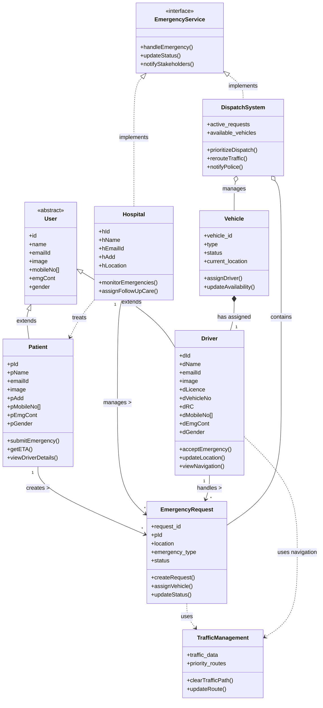

```mermaid
classDiagram
    %% Abstract class for User type
    class User {
        <<abstract>>
        +id
        +name
        +emailId
        +image
        +mobileNo[]
        +emgCont
        +gender
    }

    class Patient {
        +pId
        +pName
        +emailId
        +image
        +pAdd
        +pMobileNo[]
        +pEmgCont
        +pGender
        +submitEmergency()
        +getETA()
        +viewDriverDetails()
    }

    class Driver {
        +dId
        +dName
        +emailId
        +image
        +dLicence
        +dVehicleNo
        +dRC
        +dMobileNo[]
        +dEmgCont
        +dGender
        +acceptEmergency()
        +updateLocation()
        +viewNavigation()
    }

    class Hospital {
        +hId
        +hName
        +hEmailId
        +hAdd
        +hLocation
        +monitorEmergencies()
        +assignFollowUpCare()
    }

    class EmergencyRequest {
        +request_id
        +pId
        +location
        +emergency_type
        +status
        +createRequest()
        +assignVehicle()
        +updateStatus()
    }

    class Vehicle {
        +vehicle_id
        +type
        +status
        +current_location
        +assignDriver()
        +updateAvailability()
    }

    class DispatchSystem {
        +active_requests
        +available_vehicles
        +prioritizeDispatch()
        +rerouteTraffic()
        +notifyPolice()
    }

    class TrafficManagement {
        +traffic_data
        +priority_routes
        +clearTrafficPath()
        +updateRoute()
    }

    class EmergencyService {
        <<interface>>
        +handleEmergency()
        +updateStatus()
        +notifyStakeholders()
    }

    %% Inheritance (Generalization)
    User <|-- Patient : extends
    User <|-- Driver : extends

    %% Implementation (Realization)
    EmergencyService <|.. DispatchSystem : implements
    EmergencyService <|.. Hospital : implements

    %% Association
    Patient "1" --> "*" EmergencyRequest : creates >
    Hospital "1" --> "*" EmergencyRequest : manages >
    Driver "1" --> "*" EmergencyRequest : handles >

    %% Aggregation
    DispatchSystem o-- EmergencyRequest : contains
    DispatchSystem o-- Vehicle : manages

    %% Composition
    Vehicle *-- "1" Driver : has assigned

    %% Dependency
    EmergencyRequest ..> TrafficManagement : uses
    Driver ..> TrafficManagement : uses navigation
    Hospital ..> Patient : treats
```